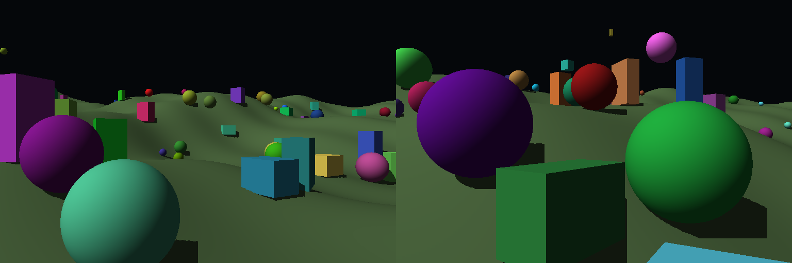

# synthetic-scene

Tiny CUDA/PyTorch synthetic scene renderer.



The renderer draws Lambert-shaded geometric objects entirely in CUDA and can
return batched RGB plus panoptic-friendly segmentation tensors. It supports up
to 64 spheres, 64 oriented boxes, and one procedural terrain per scene. Batched
renders draw different camera-space scenes.

## Build

```bash
conda run -n clipdino-cu117 python setup.py build_ext --inplace
```

## Render

```bash
conda run -n clipdino-cu117 python -m examples.render
```

The example writes `outputs/render.png` plus side-by-side colorized instance and
semantic label-map visualizations. Random renders include a generated rolling
procedural terrain, and grounded objects are placed on that terrain.

You can render a scene directly from Python:

```python
from synthetic_scene import OrientedBoxes, RenderOptions, Scene, Spheres, Terrain, render_scene

image = render_scene(
    width=768,
    height=512,
    options=RenderOptions(shadows=True, shadow_strength=1.0, ambient=0.16),
    scene=Scene(
        spheres=Spheres(
            centers=[(-0.8, 0.0, -3.0), (0.8, 0.0, -3.2)],
            radii=[0.55, 0.65],
            colors=[(0.9, 0.25, 0.18), (0.2, 0.65, 0.95)],
        ),
        terrain=Terrain(
            base_heights=[-1.0],
            depth_limits=[7.0],
            phase_xs=[0.4],
            phase_zs=[1.2],
            dz=[0.05],
            dz_growth=[0.0001],
            colors=[(0.36, 0.46, 0.30)],
        ),
        boxes=OrientedBoxes(
            centers=[(0.0, -0.35, -2.6)],
            half_sizes=[(0.38, 0.42, 0.55)],
            axes=[
                (
                    (0.866, 0.0, -0.5),
                    (0.0, 1.0, 0.0),
                    (0.5, 0.0, 0.866),
                ),
            ],
            colors=[(0.45, 0.9, 0.48)],
        ),
    ),
)
```

RGB tensors are returned as `B x 3 x H x W`. Unbatched scene tensors return
`B = 1`; scene tensors shaped as `B x N x ...` render one independent scene per
batch item. Object coordinates are camera-space, with the camera at the origin
looking down `-Z`.

Directional-light hard shadows are enabled by default. Set
`RenderOptions(shadows=False)` to render direct Lambert shading without shadow
rays, or tune `shadow_strength` in `[0, 1]` to control how much blocked direct
light is removed. The default `1.0` leaves shadowed pixels at the same ambient
floor as surfaces facing away from the light. Increase `ambient` to soften both
cast shadows and unlit object sides together.

To request segmentation ground truth, pass `return_maps=True`:

```python
from synthetic_scene import render_scene, save_image, save_label_map_visualization

result = render_scene(width=768, height=512, scene=scene, return_maps=True)
save_image(result.image[0].permute(1, 2, 0), "outputs/render.png")
save_label_map_visualization(result.instance_map[0], "outputs/instance_map.png")
save_label_map_visualization(result.semantic_map[0], "outputs/semantic_map.png")
```

`instance_map` is a `B x H x W int32` tensor with `0` for background and one
sequential ID for each visible object in that image. `visible_count` is a
`B int32` tensor with the number of visible objects per image, and
`visible_classes` is a `B x MAX_GT int32` tensor where columns
`0:visible_count[b]` contain the class labels corresponding to instance IDs
`1:visible_count[b]` in `instance_map[b]`. `MAX_GT` is the total number of
objects in the scene. Class labels are `1 = sphere`, `2 = terrain`, `3 = box`;
unused class slots and background pixels are `0`.

`semantic_map` is also returned as a `B x H x W int32` compatibility tensor with
primitive class labels per pixel: `0 = background`, `1 = sphere`,
`2 = terrain`, `3 = box`.
Raw label maps are saved as 16-bit PNGs so the numeric IDs are preserved. The
visualization helper maps each consecutive integer label to a deterministic
random RGB color, keeping background label `0` black.

## Random Scenes

For synthetic data generation, create seeded random camera-space scenes:

```python
from synthetic_scene import random_scene, render_scene

width = 768
height = 512
generated = random_scene(
    seed=1234,
    batch_size=8,
    aspect_ratio=width / height,
    depth_limit=7.0,
    terrain_dz=0.05,
    terrain_dz_growth=0.0001,
)
result = render_scene(
    width=width,
    height=height,
    scene=generated.scene,
    return_maps=True,
)
```

Random scenes always include a generated procedural terrain, include both
grounded and floating primitives, and generate objects by sampling screen-space
coordinates within the camera frustum plus a camera distance. Grounded
primitives are placed by sampling the terrain height at their X/Z location.

## Benchmark

```bash
conda run -n clipdino-cu117 python -m examples.benchmark
```

The benchmark renders the same seeded random scene style as `examples.render`
with a batch size of 8 by default. You can sweep the image size, batch size,
sample count, and random seed:

```bash
conda run -n clipdino-cu117 python -m examples.benchmark --width 1920 --height 1080 --batch-size 16 --iterations 200 --seed 5678
```

The benchmark reports CUDA event timing for the render kernel, synchronized host
wall time, output tensor size, and PyTorch CUDA allocated/reserved memory peaks.
